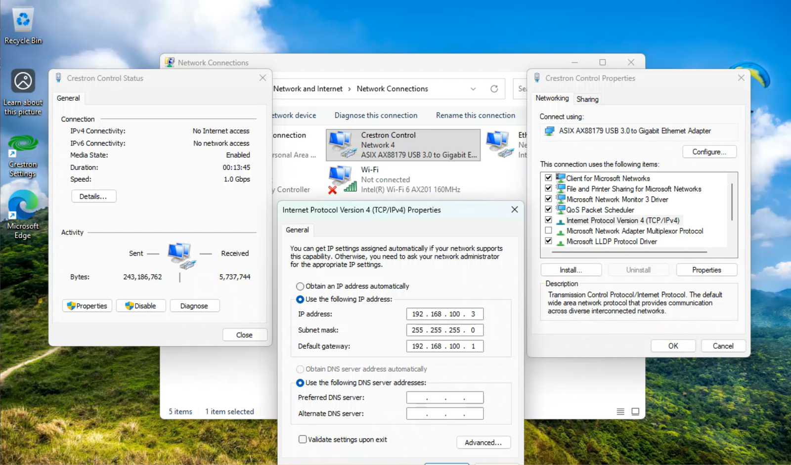
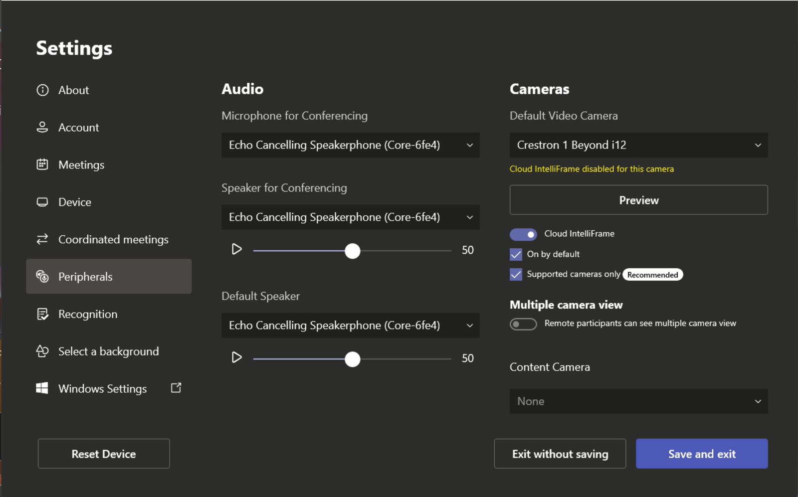

# UC-Engine Configuration

**Section last revised:** 2026-10-08

## Variables

| Variable | Description | Default value |
|---|---|---|
| {{IP}} | IP address of the control network adapter | 192.168.100.3 |
| {{SUBNET_MASK}} | Subnet mask | 255.255.255.0 |
| {{GATEWAY}} | "Default Router" | 192.168.100.1 |
| {{IP_ID}} | IP-ID in the IP table | 3 |
| {{AUDIO_DEVICE}} | Audio device to select (e.g. QSC Core) | none |
| {{CAMERA}} | Camera to select | Crestron 1 Beyond i12 |
| {{UI_FILE}} | Control interface file (.ch5z) | none |

## Content

The system is equipped with a Crestron UC-Engine Teams computer that allows users to place and receive calls. The following items are covered in this section:

- Device communication configuration.
- IP table configuration.
- Audio and video peripheral configuration.
- Loading the control interface.

## Device communication configuration

Configure the network adapter dedicated to communication with the processor using the information below:

| Setting | Value |
|---|---|
| **IP address** | {{IP}} |
| **Subnet mask** | {{SUBNET_MASK}} |
| **"Default Router"** | {{GATEWAY}} |

It is recommended to rename the network adapter "Crestron Control".

## IP table configuration

Configure the UC-Engine IP table to communicate with the processor (IP-ID {{IP_ID}}). See the table in the appendix for more information. You can assign the ID using Crestron Toolbox or the Crestron Settings application in administrator mode.

## Audio and video peripheral configuration

Make sure to select the {{AUDIO_DEVICE}} audio devices as well as the {{CAMERA}} camera in the UC-Engine.

## Loading the control interface

The procedure below explains how to load the control interface. It is important to load the configuration files before loading the code.

1. Use the "**Text Console**" option in the Crestron Toolbox software and connect to the UC-Engine over the network.
2. Once connected, use the "**Project**" option in the Crestron Toolbox software.
3. Click the "**Browse**" button, choose the file **{{UI_FILE}}** and select "**Open**".
4. Click the "**Send**" button to upload the panel to the UC-Engine.
