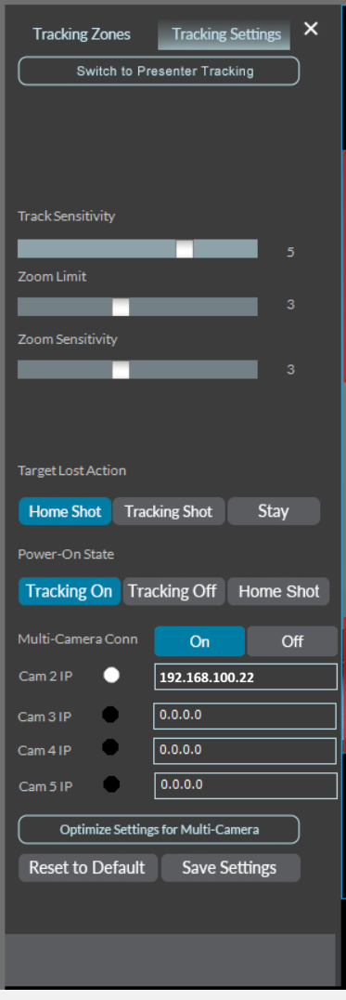

# Configuration Caméras 1 Beyond

**Logiciel de référence :** Crestron 1 Beyond Camera Manager
**Dernière révision de la section :** 2026-10-03

## Variables

| Variable | Description | Valeur par défaut |
|---|---|---|
| {{AV_VLAN}} | VLAN du réseau AV | 100 |

Valeurs par défaut par unité :

| Caméra | Adresse IP | Masque | « Default Router » |
|---|---|---|---|
| I12 | 192.168.100.21 | 255.255.255.0 | 192.168.100.1 |
| I20 | 192.168.100.22 | 255.255.255.0 | 192.168.100.1 |
| I20 (3e caméra, zone supplémentaire) | 192.168.100.23 | 255.255.255.0 | 192.168.100.1 |

## Contenu

Le système est équipé de caméras Crestron 1 Beyond I12 et I20. La caméra I12 est utilisée pour faire du cadrage de groupe tandis que la caméra I20 est utilisée pour faire un cadrage de présentateur. La configuration doit se faire via le logiciel Crestron 1 Beyond Camera Manager. Voici les items couverts dans cette section :

- Configuration réseau.
- Configuration du mode « Intelligent Switching ».
- Configuration des zones de cadrage.

## Configuration réseau

Les caméras devraient recevoir une adresse IP via le DHCP du VLAN {{AV_VLAN}} du commutateur réseau. Pour conserver une constance entre les différentes salles, nous allons assigner une adresse statique à chacune des caméras. Vous pouvez effectuer cette opération en utilisant le logiciel 1 Beyond Camera Manager. Voici les informations à configurer :

{{UNIT_TABLE : Caméra, Adresse IP, Masque, « Default Router »}}

<!-- IF: une caméra I12 et au moins une caméra I20 sont présentes -->
## Configuration du mode « Intelligent Switching »

Pour configurer le mode « Intelligent Switching », connectez-vous à la caméra I12. Sous l'option « Tracking Settings », vous devez entrer l'adresse IP de la caméra I20 dans le champ « CAM 2 IP ». Assurez-vous d'activer l'option « Optimize settings for multi camera » et ensuite confirmer le tout en appuyant sur « Save Settings ».

Assurez-vous d'activer « Tracking On » dans l'option « POWER On State ».

<!-- END IF -->

## Configuration des zones de cadrage

Il est important d'ajuster les items ci-dessous :

1. Sélectionner un « Zone Profile ».
2. « Set Tracking Zone ».
3. « Set Tracking Shot ».
   <!-- IMAGE NEEDED: Tracking Zone (capture d'origine retirée : vue de la salle d'un client) -->
4. Effectuer le « PTZ Alignment ».
   <!-- IMAGE NEEDED: PTZ Alignment (capture d'origine retirée : vue de la salle d'un client) -->
5. Ajuster les « Displays Blocking Zones B1 – B4 ».
6. Ajuster les « Users Blocking Zones B5 – B6 ».
7. Ajuster les « Preset Zones P1 – P4 ».
   <!-- IMAGE NEEDED: Preset Zones (capture d'origine retirée : vue de la salle d'un client) -->
8. Ajuster la position de chacune des « Preset Zones » définies en appuyant sur le bouton « Set Presets » du menu.
   <!-- IMAGE NEEDED: Set Presets (capture d'origine retirée : vue de la salle d'un client) -->
9. Sauvegarder les ajustements avec « Save Settings » avant de fermer.
