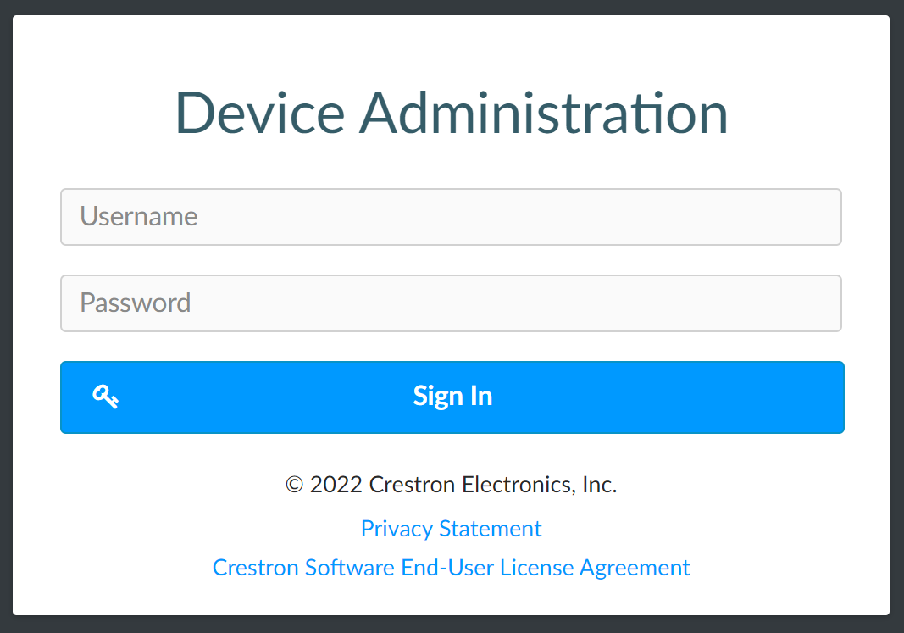
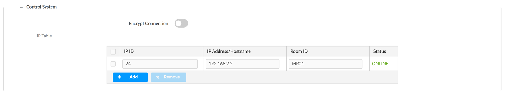

# Décodeur DM-NVX-D30

**Dernière révision de la section :** 2026-10-03

## Variables

| Variable | Description | Valeur par défaut |
|---|---|---|
| {{USERNAME}} / {{PASSWORD}} | Compte de connexion | aucune |
| {{LOCATION}} | Emplacement et rôle des unités dans la salle (ex. « dans le cabinet AV pour le partage de contenu ») | aucune |
| {{AV_VLAN}} | VLAN du réseau AV | 100 |
| {{SUBNET}} | Trois premiers octets du réseau AV | 192.168.100 |

Les adresses IP et les IP-ID de chaque unité figurent dans le tableau en annexe.

## Contenu

Le boîtier décodeur D30 est installé {{LOCATION}}. Le boîtier est alimenté par PoE++ via le port réseau auquel il est raccordé. Cette section traite des points ci-dessous :

- Plage d'adresses IP
- Compte de connexion
- Configuration Table IP
- Configuration de sortie

## Plage d'adresses IP

Le décodeur D30 devrait recevoir une adresse IP via le DHCP du VLAN {{AV_VLAN}} du commutateur réseau. Consulter le tableau en annexe pour plus d'information.

## Compte de connexion

Le compte par défaut a été remplacé par les informations ci-dessous :

**{{USERNAME}} / {{PASSWORD}}**

Pour accéder aux options de configuration de chacune des unités, vous pouvez utiliser l'application DM NVX Tool ou un fureteur web en tapant l'adresse suivante : https://{{SUBNET}}.x.

## Configuration Table IP

Chaque unité a besoin d'avoir un ID unique pour communiquer avec le processeur. Consulter le tableau en annexe pour plus d'information. Vous pouvez assigner le ID via Crestron Toolbox, DM NVX Tool ou bien en utilisant l'interface web de l'unité en sélectionnant « Settings » et en choisissant la section « Control System ».

## Configuration de sortie

Aucune configuration de sortie n'est nécessaire, simplement sélectionner « follow transmitter ».
