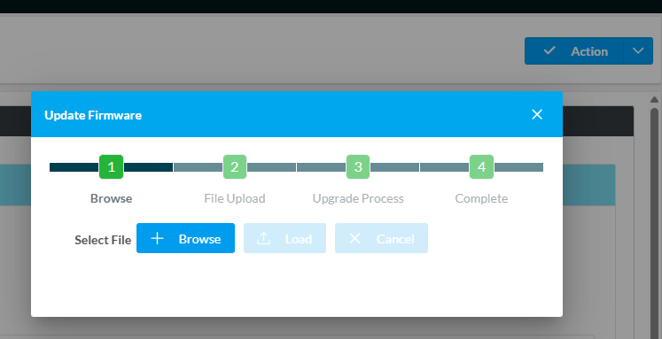

# Configuration Contrôleur Crestron RMC4

**Version du micrologiciel de référence :** RMC4 2.8006.00284.01
**Dernière révision de la section :** 2026-10-03

## Variables

| Variable | Description | Valeur par défaut |
|---|---|---|
| {{IP}} | Adresse IP statique du contrôleur | 192.168.100.2 |
| {{SUBNET_MASK}} | Masque | 255.255.255.0 |
| {{GATEWAY}} | « Default Router » | 192.168.100.1 |
| {{HOSTNAME}} | Nom d'hôte | UC-01 |
| {{USERNAME}} / {{PASSWORD}} | Compte administrateur | aucune |
| {{AV_VLAN}} | VLAN du réseau AV | 100 |
| {{FIRMWARE_FILE}} | Fichier de micrologiciel installé | aucune |
| {{PROGRAM_FILE}} | Fichier du programme (.spz) | aucune |

## Contenu

Voici les items couverts dans cette section.

- Configuration réseau.
- Configuration d'authentification.
- Configuration horloge du système.
- Mise à jour du micrologiciel.
- Implantation du code.

Lors du démarrage initial du processeur, il est demandé d'entrer un mot de passe par défaut. Voici l'usager et le mot de passe qui ont été configurés.

**{{USERNAME}} / {{PASSWORD}}**

## Configuration réseau

Le processeur devrait recevoir une adresse IP via le DHCP du VLAN {{AV_VLAN}} du commutateur réseau. Pour conserver une constance entre les différentes salles, nous allons assigner l'adresse statique **{{IP}}**. Vous pouvez effectuer cette opération en utilisant Crestron Toolbox.

1. Utiliser l'option « **Text Console** » dans le logiciel Crestron Toolbox et vous brancher au RMC4 via réseau ou USB.
2. Lorsque branché, utiliser l'option « **Ethernet Addressing** » dans le menu « **Functions** ».
3. Cocher l'option « **IP Static** » et entrer les paramètres ci-dessous :

| Paramètre | Valeur |
|---|---|
| **Adresse IP** | {{IP}} |
| **Masque** | {{SUBNET_MASK}} |
| **« Default Router »** | {{GATEWAY}} |
| **Nom d'hôte** | {{HOSTNAME}} |

4. Lorsque complété, appuyer sur « **Apply** » et le processeur va redémarrer.

## Configuration d'authentification

Il est conseillé de procéder à la configuration des options d'authentification. Vous pouvez y ajouter des usagers, des groupes et d'autres options de sécurité. Nous allons modifier les sections « **Blocked IPs** » et « **Authentication Options** » ; simplement suivre les étapes ci-dessous.

1. Utiliser l'option « **Text Console** » dans le logiciel Crestron Toolbox et vous brancher au RMC4 via réseau ou USB.
2. Lorsque branché, utiliser l'option « **Authentication** » dans le menu « **Functions** ».
3. Sélectionner l'onglet « **Blocked IPs** ».
4. Cocher l'option « **No Limit** ».
5. Appuyer sur « **Remove Address From Blocked List** » si des adresses sont actuellement bloquées.
6. Sélectionner l'onglet « **Authentication Options** ».
7. Cocher l'option « **No Attempt Limit** ».

Si vous désirez ajouter d'autres utilisateurs, il est possible de le faire via l'onglet « **Users** ».

1. Sélectionner l'onglet « **Current User** ».
2. Appuyer sur le bouton « **Create New User** ».
3. Entrer un nom d'usager, un mot de passe et sélectionner un groupe.
4. Appuyer sur le bouton « **OK** » pour confirmer l'ajout.

## Configuration horloge du système

Suivre les étapes ci-dessous pour configurer l'heure du système.

1. Utiliser l'option « **Text Console** » dans le logiciel Crestron Toolbox et vous brancher au RMC4 via réseau ou USB.
2. Lorsque branché, utiliser l'option « **System Clock** » dans le menu « **Functions** ».
3. Sélectionner le bon fuseau horaire à partir du menu déroulant « **Timezone** ».
4. Appuyer sur le bouton « **Synchronize Device Time with PC** » si vous n'utilisez pas l'option SNTP.

<!-- IF: un serveur SNTP est fourni pour le projet -->
Vous pouvez utiliser un serveur SNTP pour synchroniser l'heure du processeur. Vous devez procéder aux étapes 1 à 3, suivies des étapes suivantes :

5. Cocher l'option « **Enable SNTP** ».
6. Entrer l'adresse du serveur SNTP fourni dans le champ « **Server** ».
7. Appuyer sur le bouton « **Synchronize Device Time using SNTP Now** ».
<!-- END IF -->

## Mise à jour du micrologiciel

Il est important de procéder à la mise à jour du contrôleur. Lors de l'installation, nous avons procédé à la mise à jour la plus récente du micrologiciel du RMC4.

**{{FIRMWARE_FILE}}**

Pour procéder à la mise à jour du logiciel, il est possible de le faire via un fureteur web en entrant l'adresse suivante https://{{IP}} et en suivant la procédure ci-dessous :

1. Sélectionner l'option « **Update Firmware** » dans l'option « Action » sur la page web du processeur.
2. Appuyer sur le bouton « Browse » et choisir le micrologiciel à téléverser.
3. Suivre la procédure et attendre que le processus soit terminé.

## Implantation du code

La procédure ci-dessous explique la démarche à utiliser pour implanter le code qui permettra au système d'opérer. Il est important d'implanter les fichiers de configuration avant d'implanter le code.

1. Utiliser l'option « **Text Console** » dans le logiciel Crestron Toolbox et vous brancher au RMC4 via réseau ou USB.
2. Lorsque branché, utiliser l'option « **Simpl Program (Program01)** » dans le logiciel Crestron Toolbox.
3. Appuyer sur le bouton « **Browse** », choisir le fichier **{{PROGRAM_FILE}}** et sélectionner « **Open** ».
4. Appuyer sur le bouton « **Send** » pour téléverser le code vers le contrôleur.
