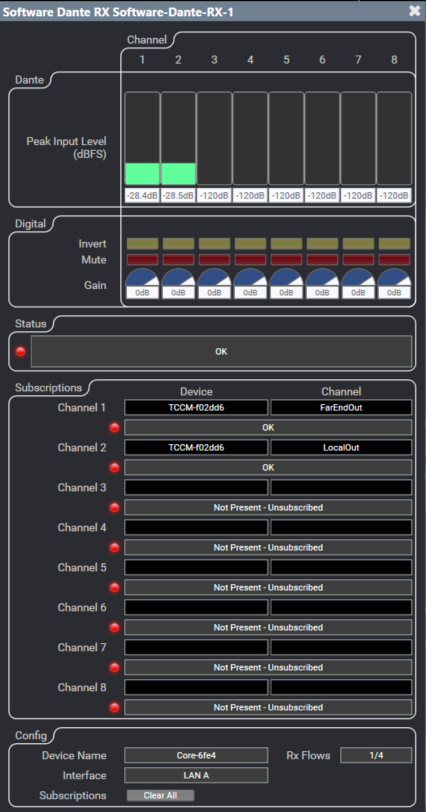
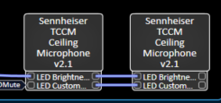

# Configuration Processeur Audio QSC

**Version logicielle de référence :** Q-SYS Designer 10.4.0
**Dernière révision de la section :** 2026-10-03

## Variables

| Variable | Description | Valeur par défaut |
|---|---|---|
| {{IP}} | Adresse IP statique du processeur | 192.168.100.10 |
| {{SUBNET_MASK}} | Masque | 255.255.255.0 |
| {{GATEWAY}} | « Default Router » | 192.168.100.1 |
| {{AV_VLAN}} | VLAN du réseau AV | 100 |
| {{QSYS_VERSION}} | Version logicielle utilisée au déploiement | 10.4.0 |

## Contenu

Le système est équipé d'un processeur audio QSC qui permet l'intégration audio des différentes sources et destinations. Vous aurez besoin du logiciel Q-SYS Designer pour les étapes suivantes. Voici les items couverts dans cette section :

- Configuration réseau.
- Assignation du nom du système.
- Implantation de la filière audio.
- Configuration des différents canaux audio et contrôles.

## Configuration réseau

Le processeur devrait recevoir une adresse IP via le DHCP du VLAN {{AV_VLAN}} du commutateur réseau. Pour conserver une constance entre les différentes salles, nous allons assigner l'adresse statique **{{IP}}**. Vous pouvez effectuer cette opération en utilisant le logiciel Q-SYS Designer ou via un fureteur web. Voici les informations à configurer :

| Paramètre | Valeur |
|---|---|
| **Adresse IP** | {{IP}} |
| **Masque** | {{SUBNET_MASK}} |
| **« Default Router »** | {{GATEWAY}} |

## Assignation du nom du système

Il y a plusieurs systèmes et chacun d'eux devrait avoir une configuration différente. Il est important que chacune des salles ait sa filière DSP. Il existe une filière modèle qui est utilisée comme référence : renommer le processeur Q-SYS et sauvegarder la filière modèle sous un autre nom qui devrait contenir l'information de la salle (étage, numéro de local, nom de salle, etc.).

## Implantation de la filière audio

Suivre la procédure habituelle pour implanter la filière audio dans les DSP. Lors du déploiement initial, la version logicielle utilisée est {{QSYS_VERSION}}.

## Configuration des différents canaux audio et contrôles

Il est important de configurer le canal audio utilisé pour les microphones, voir l'image ci-dessous.

<!-- IF: des tuiles Sennheiser TCCM sont présentes -->
Il est aussi important d'entrer les informations de contrôle API des tuiles Sennheiser dans les blocs de contrôle. Voir l'image ci-dessous.

<!-- IMAGE NEEDED: champs IP Address / Username / Password du bloc de contrôle (capture d'origine retirée : elle affichait un mot de passe) -->
<!-- END IF -->
