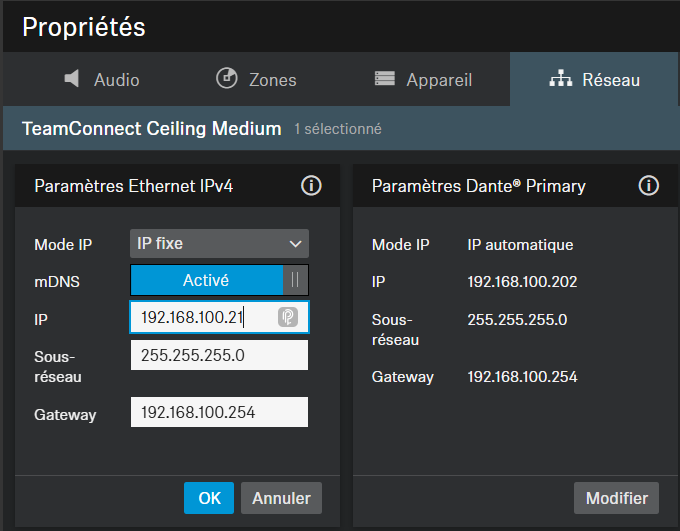

# Configuration Tuile Sennheiser TCCM

**Logiciels de référence :** Sennheiser Control Cockpit, Dante Controller
**Dernière révision de la section :** 2026-10-03

## Variables

| Variable | Description | Valeur par défaut |
|---|---|---|
| {{AV_VLAN}} | VLAN du réseau AV | 100 |
| {{API_USERNAME}} | Usager de l'API de contrôle | api |
| {{API_PASSWORD}} | Mot de passe de l'API de contrôle | aucune |

Aucune adresse par défaut par unité : les documents d'origine se contredisent (voir « Notes »). Les adresses viennent de la liste d'équipements.

## Contenu

Le système est équipé de tuile(s) Sennheiser TCCM pour la captation audio. Vous aurez besoin du logiciel Sennheiser Control Cockpit ainsi que du logiciel Dante Controller pour la configuration. Voici les items couverts dans cette section :

- Configuration réseau contrôle et audio.
- Mise à jour logiciel.
- Activation de l'API de contrôle.
- Assignation des références audio.

## Configuration réseau contrôle et audio

La (les) tuile(s) devraient recevoir une adresse IP via le DHCP du VLAN {{AV_VLAN}} du commutateur réseau. Pour conserver une constance entre les différentes salles, nous allons assigner une adresse statique à chacune des tuiles. Vous pouvez effectuer cette opération en utilisant le logiciel Sennheiser Control Cockpit. Voici les informations à configurer :

{{UNIT_TABLE : Tuile, Adresse IP Contrôle, Masque, « Default Router »}}

Il n'est pas nécessaire de configurer l'adresse IP pour l'audio, car le VLAN {{AV_VLAN}} fournit du DHCP.

## Mise à jour logiciel

Assurez-vous de mettre à jour le logiciel des tuiles via Sennheiser Control Cockpit.

## Activation de l'API de contrôle

Assurez-vous d'activer l'API de contrôle dans les tuiles et d'utiliser le mot de passe « {{API_PASSWORD}} ». L'usager devrait être « {{API_USERNAME}} ».

<!-- IMAGE NEEDED: onglet Accès / API sécurisée (capture d'origine retirée : elle affichait un mot de passe) -->

## Assignation des références audio

Section à compléter.

## Notes

- Dans les documents d'origine, cette section donnait les adresses de contrôle 192.168.100.5 et .6 avec la passerelle 192.168.100.254, alors que l'annexe donnait 192.168.100.31 et .32 avec la passerelle 192.168.100.1 (et .5/.6 servent aussi aux HD-CTL-101). À trancher avant d'ajouter des valeurs par défaut.
