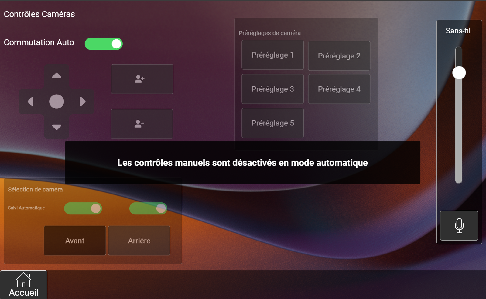

# Programme : salle de formation et multifonctionnelle

**Dernière révision de la section :** 2026-10-03

Cette section décrit le programme de contrôle, pas un équipement. Elle fournit deux parties du document : « Information du système » (au début) et « Configuration logiciel » (après les équipements).

## Information du système

Voici la fonctionnalité du modèle de salle de formation et multifonctionnelle. Le système est en mode automatique et les moniteurs s'allument selon l'état du Crestron UC-CX100-T. Une page de contrôle avancé est disponible pour l'ajustement du (des) microphone(s). Lorsque le système retourne en mode veille, les ajustements personnalisés aux niveaux des microphones sont réinitialisés à la valeur par défaut.

### Page de contrôle de salle

Le système est équipé d'une page de contrôle pour le microphone sans-fil et le système de caméra. Le système de caméra devrait toujours être en mode commutation automatique. Le contrôle manuel permet à l'utilisateur de prendre le contrôle. Le système retourne en mode automatique lorsqu'un appel est lancé. Cette page retourne automatiquement aux contrôles de réunion après un délai de 60 secondes ou lorsque l'usager appuie sur la touche Accueil.

## Configuration logiciel

### Fichier de configuration

Lors du téléversement initial du système, le fichier de configuration sera automatiquement créé dans le dossier User du processeur.

### Commandes console usager

Lorsque vous êtes en console sur le processeur, en tapant « Help user » vous verrez une liste de commandes créées pour faire du débogage.

| Commande | Description |
|---|---|
| Basecfg -show | Affiche le fichier de configuration. |
| Dsp -report | Affiche les informations du DSP. |
| Maincam -report | Affiche les informations de la caméra I12. |
| Room -cfg | Affiche la configuration de salle. |
| Trackcam -report | Affiche les informations de la caméra I20. |
| Uce -report | Affiche les informations du UC-Engine. |
| Videodisplay -on | Allume le moniteur. |
| Videodisplay -off | Éteint le moniteur. |
